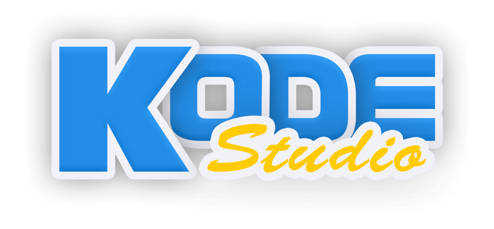
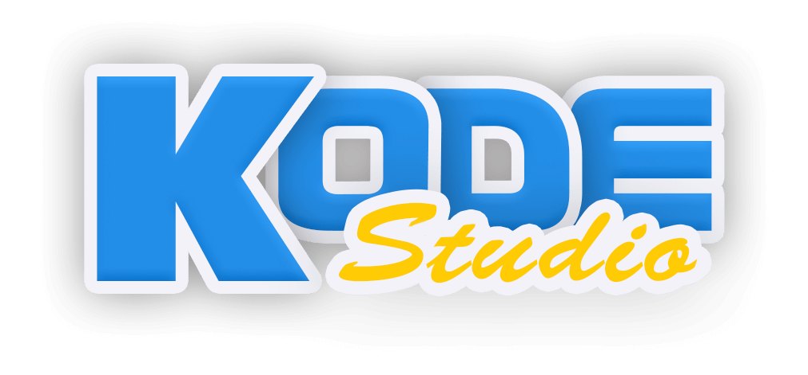
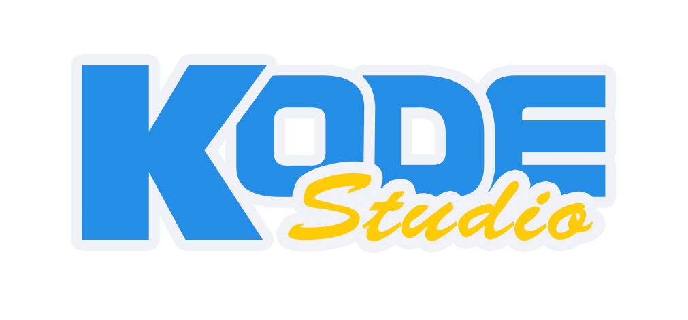
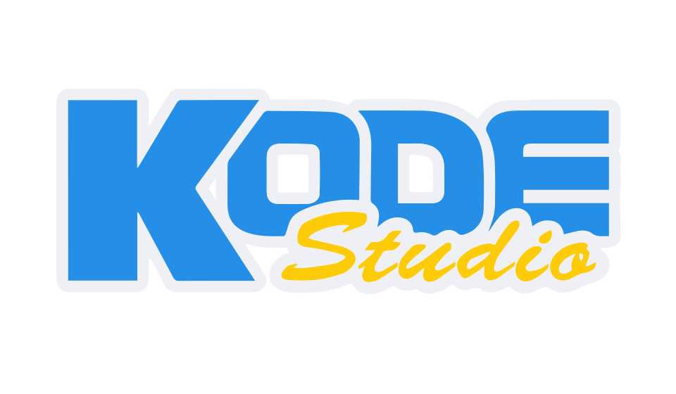

# Logos & ID

-----------------------------------

<strong>'Kode Studio' PNG logos:<strong>

#### Kode Studio _ logo _ 16b->8b color - tiny [compressed] . png  
#### <a href="./Sondro/1080p/compressed/ks_logo_m16b_ty.png">ks_logo_m16b_ty.png</a>
1080p 34kb 16b->8b compressed logo with shadow. 

-----------------------------------

#### Kode Studio _ logo _ 8b color - tiny [compressed] . png  
#### <a href="./Sondro/1080p/compressed/ks_logo_8mb_ty.png">ks_logo_m8b_ty.png</a>
1080p 44kb 8b compressed logo with shadow. 

-----------------------------------

#### Kode Studio _ logo _ 8b color - no gradient tiny [compressed] . png  
#### <a href="./Sondro/1080p/compressed/ks_logo_8b_no_gradient_ty.png">ks_logo_8b_no_gradient_ty.png</a>
1080p 21kb 8b compressed no gradient logo. 

-----------------------------------

<strong>'Kode Studio' SVG logos:<strong>

#### Kode Studio _ logo _ no _ gradient . svg  
#### <a href="./Sondro/1080p/compressed/ks_logo_8b_no_gradient.svg">ks_logo_8b_no_gradient.svg</a>
Scalable(1080p+) 17kb SVG with no gradient. 

-----------------------------------

<strong>'K' icons:</strong>

#### k - with shadow _ 256 colors _ 16px X 16px _ png  
#### <a href="./Sondro/32px-/k-sh_256c_16px.png">k-sh_256c_16px.png</a>
[Old] Web favorites, [old] tray icon. 

-----------------------------------

#### k - with shadow _ 8-bit color _ 16px X 16px _ png  
#### <a href="./Sondro/32px-/k-sh_8b_16px.png">k-sh_8b_16px.png</a>
[old] Web favorites, [old] tray icon. 

-----------------------------------

#### k - with shadow _ 8-bit color _ 32px X 32px _ png  
#### <a href="./Sondro/32px-/k-sh_8b_32px.png">k-sh_8b_32px.png</a>
Web favorites, tray icon. 

-----------------------------------

#### k - with shadow _ 8-bit color _ 192px X 192px _ png
#### <a href="./Sondro/512px-/k-sh_8b_192px_chrome.png">k-sh_8b_192px_chrome.png</a>
Chrome browser favicon. 

-----------------------------------

#### k - with shadow _ 8-bit color _ 200px X 200px _ png
#### <a href="./Sondro/512px-/k-sh_8b_200px_github.png">k-sh_8b_200px_github.png</a>
Github Kode main repo. 

-----------------------------------

#### k - with shadow _ 8-bit color _ 256px X 256px _ png
#### <a href="./Sondro/512px-/k-sh_8b_256px.png">k-sh_8b_256px.png</a>
Hi res icon.

-----------------------------------

#### k - with shadow _ 8-bit color _ 416px X 407px _ png
#### <a href="./Sondro/1080p/k-sh_8b_416x407px.png">k-sh_8b_416x407px.png</a>
1080p logo.

-----------------------------------

#### k - with shadow _ 8-bit color _ 512px X 512px _ png
#### <a href="./Sondro/512px-/k-sh_8b_512px.png">k-sh_8b_512px.png</a>
Hi res icon, texture.

-----------------------------------

#### k - with shadow _ 8-bit color _ 1024px X 1024px _ png
#### <a href="./Sondro/1024px+/k-sh_8b_1024px.png">k-sh_8b_1024px.png</a>
Hi res logo, Hi res Texture.

-----------------------------------

#### k - with shadow _ 8-bit color _ 1973px X 1973px _ png
#### <a href="./Sondro/1024px+/k-sh_8b_1973px.png">k-sh_8b_1973px.png</a>
Print logo, ultra res texture.

-----------------------------------

